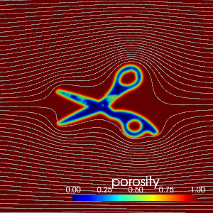
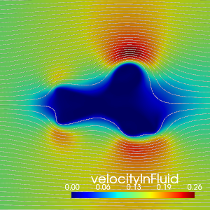
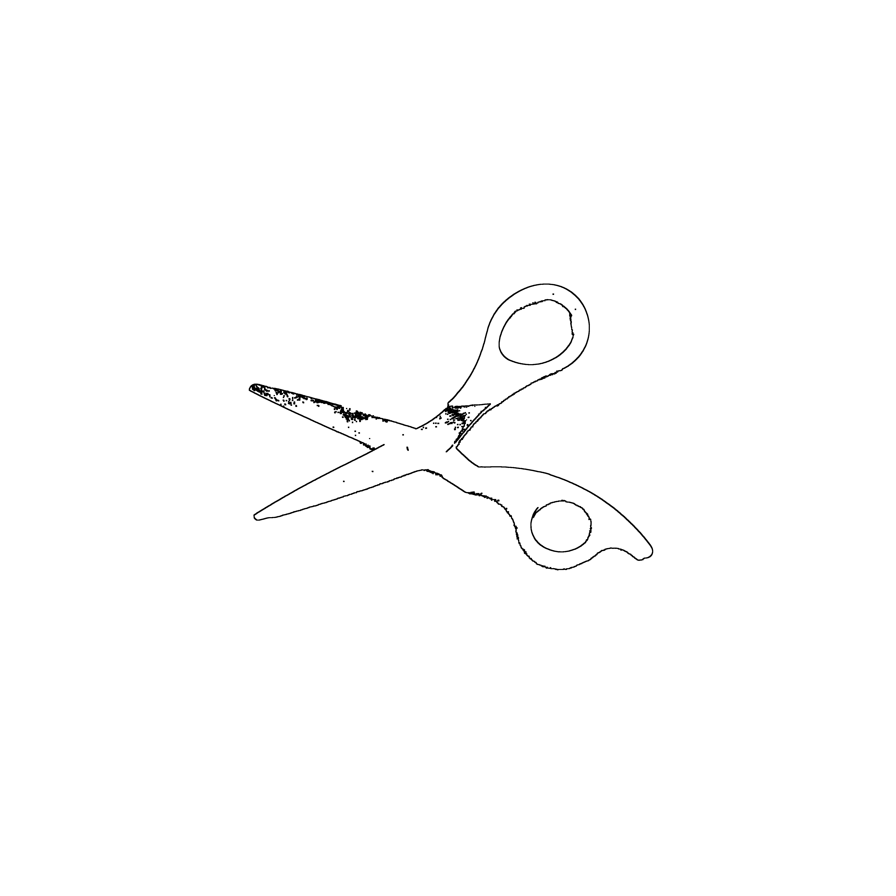
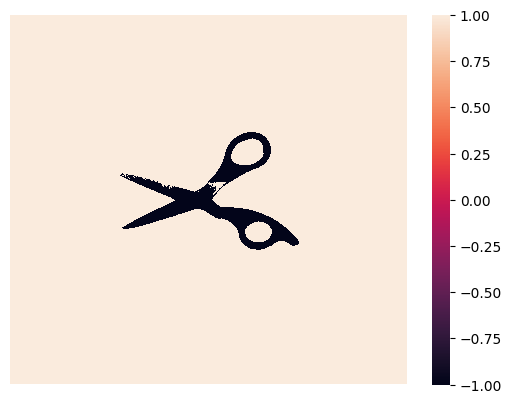
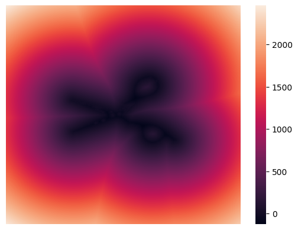
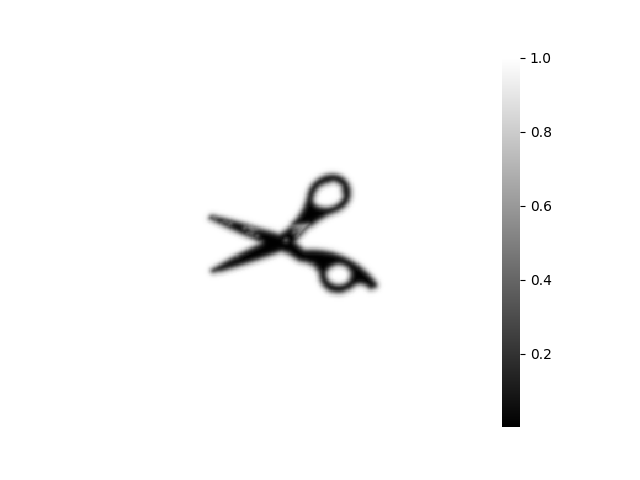

# Image Preprocessing for Immersed Boundary Method

    
    
    

In this notebook, general image processing techniques are employed on 2D images and subsequently applied to a numerical simulation program utilizing A new unified governing equation of flow incorporating immersed solid boundaries.

**Disclaimer: This code is provided for use in Google Colaboratory. The author assumes no responsibility for any damages arising from the use of this code.**

This program is provided "as-is" without any warranty. The author does not guarantee the accuracy, completeness, or suitability of the code and disclaims any liability for any damages or issues resulting from its use.

By using this code, you agree that the author shall not be liable for any direct, indirect, incidental, consequential, or any other damages or losses arising from the use of this code. You use this code at your own risk.

The user is solely responsible for understanding and managing the risks associated with the use of this code. This disclaimer is subject to change without notice.

## Basic equation

Law of conservation of mass:
$$\frac{\partial \rho \varepsilon}{\partial t}+\boldsymbol{\bigtriangledown} \cdot \rho \varepsilon \boldsymbol{u} = 0$$

Law of conservation of momentum:
$$\frac{\partial \rho \varepsilon \boldsymbol{u}}{\partial t}+\bigtriangledown \cdot \rho \varepsilon \boldsymbol{u} \boldsymbol{u}
= -\varepsilon\bigtriangledown p + \bigtriangledown\cdot \varepsilon \boldsymbol{T} + \boldsymbol{f}$$

$$\boldsymbol{T} = \mu(\bigtriangledown\boldsymbol{u}+\bigtriangledown\boldsymbol{u}^t)+\lambda (\bigtriangledown\cdot\boldsymbol{u})\boldsymbol{I}$$

Defenition of porosity distribution:

$$\displaystyle \varepsilon = \frac{1}{2} \tanh(x) + \frac{1}{2},  x = \frac{\xi}{\Delta}$$
where $\xi$ is a signed distance function.

### Grayscale

Grayscaling can be easily achieved by loading the previously resized image using OpenCV's `IMREAD_GRAYSCALE` function. Here, we explain the process that takes place within the image during the grayscaling process.

Each pixel in the image has a specific RGB (Red, Green, Blue) value, where each color has 256 steps ranging from 0 to 255 (i.e., $2^8$ or $16^2$). By performing the following operations on these RGB values, a grayscale image can be generated. This method follows the "Luminosity Method (ITU-R BT.601)."

$$ \rm{Gray} = Red \times 0.229 + Green \times 0.587 + Blue \times 0.114 $$

The following code block (the greyscale tester) conducts a test to convert an original BGR color (specified by user input) to grayscale by applying custom weights to each channel (B, G, R). Users can set these custom weights through sliders. The resulting grayscale intensity is calculated based on the specified weights, and the original and grayscale images are displayed side by side for visual comparison.

## Outline detection

    
    
    

Grayscale conversion of the original image enables contour detection through kernel operations. By combining the extracted contours with the original grayscale image, a contour-enhanced image is obtained.

## SDF

    
    
    

First, perform binarization to make the interface clear. Then, calculate the Signed Distance Field (SDF) using the Fast Marching Method (FMM), and obtain the porosity distribution by applying the sigmoid function.

## Resize

Resizing is done by the function `resize` of the OpenCV module. This function can scale an image by giving a scale factor. For example, a scale factor of 0.5 on a 100x100 image results in a 50x50 image.

Therefore, in order to convert an image to an arbitrary resolution, it is sufficient to know this scale factor. Let $\rm{(W, H)}$ denote the number of pixels in the original image and $\rm{(W', H')}$ the number of pixels in the converted image. Resolution is the total number of pixels, so if the original resolution is $\rm{R}$, the following equation holds.

$$\rm{R} = WH$$

Here, the number of pixels in the height and width of the converted image $\rm{(W', H')}$ is defined using the scale factor $s( > 0)$ and $\rm{(W, H)}$ as follows.

$$\rm{(W', H')} = (\textit{s}\rm{W}, \textit{s}\rm{H})$$

This allows the transformed resolution $\rm{R'}$ to be expressed as follows.

$$\rm{R'} = W'H' = s^2\rm{WH} $$

Solving this for $s$, we obtain.

$$s = \sqrt{\frac{R'}{WH}} $$

Therefore, given an arbitrary resolution, the coefficient $s$ can be obtained and resizing can be performed. Run the code block below and set the resolution by changing the slider bar of `resolution`. The last value you set will be the resolution used in the following program. The images are stored in the `tmp` folder.

## Reference

[1] Oshima.N, A Novel approach for wall-boundary immersed flow simulation: proposal of modified Navier-Stokes equation, Mechanical Engineering Journal. Vol.18, No.4 (2023)

[2] 大島, 流れの数値解析:固体境界が埋め込まれた改良ナビエ・ストークス方程式の解法, 北海道大学学術成果コレクション(HUBCAP), 資源タイプsoftware (2023), URL: https://eprints.lib.hokudai.ac.jp/dspace/handle/2115/89344
